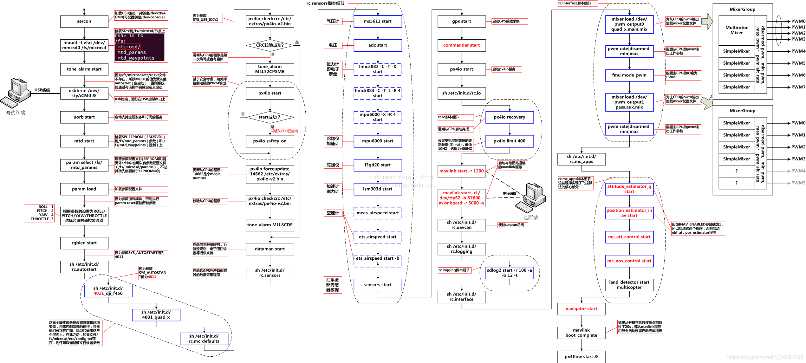

PX4启动流程，分为4步：
1.__start：
上电之后程序入口为PX4-Autopilot/platforms/NuttX/nuttx/arch/arm/src/stm32/stm32_start.c中的__start函数，负责stm32芯片的底层初始化，包括是时钟，GPIO等。

2.nx_start：
__start函数调用NuttX/nuttx/sched/init/nx_start.c中的nx_start函数，负责os的底层初始化，包括队列和进程结构等。

3.os_bringup：
nx_start函数调用/NuttX/nuttx/sched/nx_bringup.c中的nx_bringup函数，负责os基本进程的启动和用户进程的启动。用户启动入口由CONFIG_INIT_ENTRYPOINT宏定义进行指定。

4.CONFIG_INIT_ENTRYPOINT：
FMU和IO的启动入口不同，分别为：
（1）FMU中CONFIG_INIT_ENTRYPOINT宏定义为nsh_main：
[1] 调用nsh_main函数。
[2] nsh_main函数调用NuttX/apps/nshlib/nsh_consolemain.c中nsh_consolemain函数。
[3] nsh_consolemain函数调用nsh_initscript函数。
[4] nsh_initscript函数所执行的脚本即为FMU的启动脚本rcS。
[5] rcS脚本中负责挂载Sd卡，启动uorb，加载参数配置文件，启动dataman数据管理，启动各传感器，commander，执行rc.io，执行rc.interface（混控器），执行rc.mc_app（飞控姿态与位置算法）等。

（2）IO中CONFIG_USER_ENTRYPOINT宏定义为user_main：
调用src/modules/px4iofirmware/px4io.c中的user_start函数，负责IO基础环境的初始化，包括PWM，串口，ADC等，最后进入死循环，用于遥控器输入和与FMU通信的内容。

到这里为止即完成了Nuttx系统的启动，程序执行到加载启动脚本，后面即是PX4应用的启动。PX4系统层（platforms）：除了nuttx系统以外，还有common（中间件）；

二、从RCS启动脚本

启动脚本,它能够识别出你对应的飞机类型，加载对应的混控器，选择对应的姿态、位置估计程序以及控制程序，初始化你需要的驱动程序。
2.1RCS启动脚本的位置（从芯片初始化（init）到项目启动（start））
ROMFS->px4fmu_common->init.d->rcs，代码参见项目代码。
网上找的PX4启动流程图：

